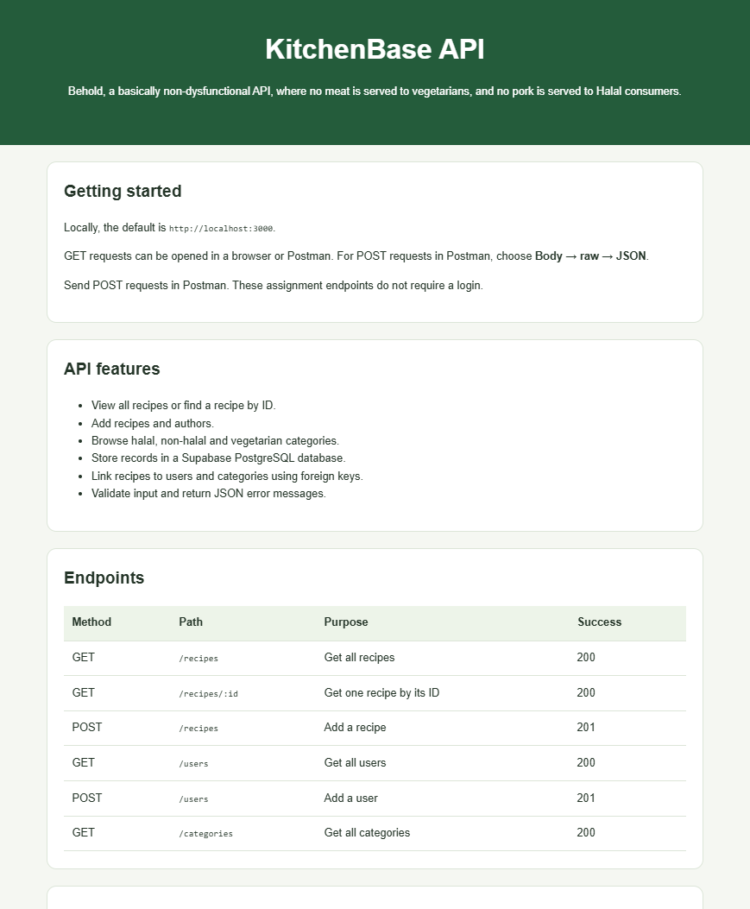

# KitchenBase Backend 🍳

An Express API for managing recipes, users, and food categories.

## Screenshot

## Features

- Get all recipes or find a recipe by ID.
- Add new recipes and users.
- View users and food categories.
- Connect recipes to authors and categories using foreign keys.

## Technologies

- Node.js
- Express
- Supabase JavaScript client
- Supabase PostgreSQL
- dotenv
- cors
- nodemon
